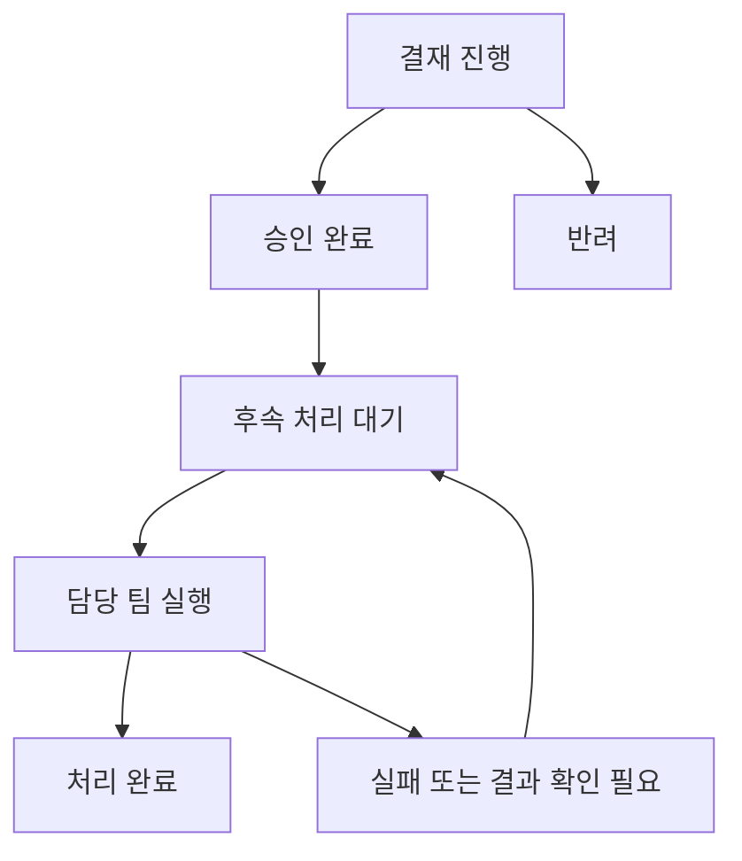

# 결재

최신 기획/화면: P18. 결재는 템플릿 기반의 인스턴스이자 스냅샷이다. API 키는 결재 완료 이후의 후속 처리이며 문서 열람, 승인/합의, 열람자 추가, 키 실행의 권한을 분리한다.

## APR-01 목록 — `/approvals`

표: 결재 문서명/ID, 요청자, 결재 상태, 후속 처리 상태, 현재 단계. 검색은 열람 가능한 문서의 제목·ID·사유·계정 문맥 내에서 수행한다. 문서명→상세. 발급 요청→APR-02. 검색 결과·전체 건수·페이지 수 모두 같은 열람자 조건을 적용한다. 필터 확장은 기획 가능하지만 현재 P18 목록은 검색·페이지 이동 중심이며 유형/상태 필터를 완료로 표시하지 않는다.

## APR-02 요청 — `/approvals/new` 및 KEY-03/04/05 진입

| 단계             | 화면/행동                                                                                                          |
| ---------------- | ------------------------------------------------------------------------------------------------------------------ |
| 1. 요청 정보     | 템플릿 선택, 서비스 어카운트, 관리서비스, endpoint, Secret name/value key, 사유. 교체/폐기는 재사용 항목 고정      |
| 2. 변경사항 검토 | 대상 계정·서비스·저장 위치·사유, endpoint 변경, 요청 시 결정될 결재선. 승인 전 아무 키/권한도 적용하지 않음을 설명 |
| 요청             | snapshot revision과 대상 유효성 검사, 템플릿 복사, 실제 라인 해석, 열람자 자동 등록, 결재 ID 생성                  |
| 완료             | 생성 문서 상세로 이동. 발급 요청은 키 관리 ID만 예약하고 발급된 키 목록에는 넣지 않음                              |

공백 사유, 다른 서비스 endpoint, 잘못된 Secret 식별자, 미해석 팀장/조직, 같은 계정+서비스의 처리 중 요청, 타 키 소유 저장 필드를 차단한다. 같은 request ID 재제출로 중복 결재를 만들지 않는다. 동시 변경이면 재검토한다.

## APR-03 상세 — `/approvals/{approvalId}`

기본 정보: 요청자, 결재 상태, 후속 처리 상태, 요청일, API 키 관리 ID, 템플릿 스냅샷 버전. 키 생성 이전에는 관리 ID를 이미 생성된 키 상세로 링크하지 않는다. 탭: **요청 정보 → 결재선 → 열람자 → 후속 처리**.

- 요청 정보: 제출 당시 여섯 입력과 endpoint, 교체 시 이전 endpoint 대비 추가/삭제/유지. 이후 템플릿 변경으로 덮어쓰지 않는다.
- 결재선: 순서·단계명·사용자/조직·상태·실제 처리자·시각. 아직 도달하지 않은 단계는 처리할 수 없다.
- 열람자: APR-05.
- 후속 처리: APR-06.

## APR-04 승인·합의·반려 검토 모달

현재 단계의 사용자 또는 대상 조직의 현재 멤버만 버튼을 사용할 수 있다. 클릭 후 요청 정보·접근 범위를 검토하고 승인/합의 또는 반려를 확정한다. 서버가 현재 단계와 revision을 다시 검사한다. 승인된 앞 단계를 건너뛰거나 미래 단계에 먼저 합의하지 않는다. 반려된 문서에서 후속 실행하지 않는다. 마지막 승인은 문서를 approved, 후속 처리를 ready로 바꾸며 키를 생성하지 않는다.

반려 의견·위임·전결·승인 취소·문서 수정/재상신은 현재 UI에 없다. 사유 입력은 요청 사유와 구분되며 추가 합의 없이 이미 제공되는 것으로 표기하지 않는다.

## APR-05 열람자 탭

| 대상/행동          | 규칙                                                                 |
| ------------------ | -------------------------------------------------------------------- |
| 요청자             | 문서 생성 시 사용자 열람자로 자동 등록                               |
| 결재선 사용자·조직 | 자동 등록. 조직을 구성원 사용자들로 복제하지 않음                    |
| 조회 판정          | 본인의 user ref가 있거나 열람자로 지정된 조직의 현재 멤버인 경우     |
| 수동 추가          | 결재선 참가자가 사용자/조직 카탈로그에서 선택. 출처·추가자·시각 기록 |
| 중복               | 같은 kind+ID는 중복 등록하지 않음                                    |
| 추가된 열람자      | 조회만 허용. 승인/합의/다른 열람자 추가 권한이 자동 부여되지 않음    |

읽기 권한을 확인할 때 결재선을 별도로 다시 합집합하지 않고 열람자 목록을 단일 원천으로 사용한다. 결재선은 승인과 열람자 추가 자격만 판정한다. 결재선 변경 기능은 현재 없고, 추후 제공하면 자동 등록분 갱신과 수동 등록분 보존을 함께 설계한다. 수동 열람자 제거 기능도 현재 범위에 없다.

## APR-06 후속 처리 탭

최종 승인 + 스냅샷에 지정된 관리서비스 조직의 현재 멤버만 실행한다. 열람자라는 이유로 실행 버튼을 주지 않는다. 승인된 입력은 읽기 전용으로 보여준다.

| 유형 | 입력/성공 결과                                                                                                 |
| ---- | -------------------------------------------------------------------------------------------------------------- |
| 발급 | 담당 팀이 API 키 원문 입력 → 지정 Secret field 저장 → 전용 정책/Orion 역할 생성·계정 부여 → hash/키 v1 및 이력 |
| 교체 | 새 원문 입력 → 같은 Secret 위치와 정책/역할 재사용 → endpoint 변경 → 새 hash/버전 및 같은 관리 ID 이력         |
| 폐기 | 키 원문 입력 없음 → 실제 키 무효화 및 전용 권한/저장 필드 처리 → 폐기 이력                                     |

원문 입력은 password 형태로 받고 처리 시 지운다. 결재 정보나 실행 로그에 원문을 저장하지 않는다. 성공 시 서버가 반환한 hash와 복사 버튼, 실행자/시각, API 키 상세 링크를 표시한다. 실패·결과 불명은 성공 처리하지 않고 결과 확인/재시도한다. P18 데모는 AWS에 쓰지 않고 원문을 보관하지 않으며 실제 키 입력을 금한다.

## 상태와 검수

실패/확인 필요는 운영 요구다. P18 모델은 waiting/ready/completed와 화면 오류 안내를 사용하며 영속적인 실패·복구 작업 상태는 서버 구현이 남아 있다.

수용 기준: 요청/승인만으로 실제 키가 생기지 않음, 결재선 순서 준수, 문서 직접 URL의 열람 검증, 수동 열람자의 권한 비승격, 최초 발급/교체/폐기가 동일 키 관리 ID 이력으로 모임, 실패한 Secret 저장에 성공 hash가 표시되지 않음을 확인한다.

### 목록 검색 수용 기준 보완

APR-01과 TPL-02의 결재 탭은 표시 제목 전체(템플릿 이름 · 서비스 어카운트), 문서 ID, 요청 사유로 검색한다. 동일 Documents/BrowseTable과 제목 생성 함수를 재사용한다. P18 후속 수정에서 구분점 `·`를 포함한 제목 검색을 보완하며 열람자 필터는 검색보다 먼저 적용한다.
